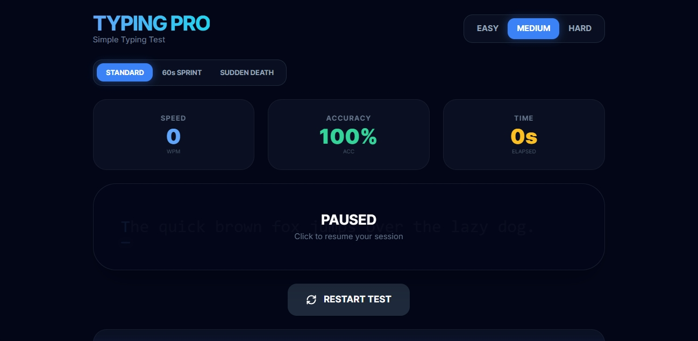

# Typing Pro

A minimalist, high-performance typing test application designed for speed and precision. Built with a focus on tactile feedback and a "mechanical keyboard" aesthetic, this tool helps users track and improve their typing metrics across multiple difficulties and game modes.



## ✨ Features

- **Three Game Modes:**
  - **Standard:** Type classic quotes at your own pace.
  - **60s Sprint:** A race against the clock. How many words can you clear?
  - **Sudden Death:** Precision training. A single mistake ends the session.
- **Dynamic Difficulty:** Switch between **Easy**, **Medium**, and **Hard** (includes code snippets and complex symbols).
- **Tactile Sound Engine:** Synthetic mechanical key sounds generated via Web Audio API (no external assets required).
- **Local Leaderboard:** Saves your top 5 performances for every configuration using `localStorage`.
- **Keyboard Optimized:** Use `Esc` for instant restarts.

## 🛠️ Built With

- **HTML5 & Vanilla JavaScript:** Core logic and sound engine.
- **Tailwind CSS:** Responsive, modern UI.
- **Google Fonts:** Inter and JetBrains Mono for a professional look.

## 🚀 Getting Started

1.  **Clone the Repository:**
    ```bash
    git clone https://github.com/AxtyTheDev/Typing-Test.git
    ```
2.  **Open and Play:** Open `index.html` in any modern web browser and start typing!

## ⌨️ Shortcuts

| Key | Action |
|-----|--------|
| `Esc` | Instant Restart |
| `Click` | Resume Focus |

## 📜 License

This project is licensed under the MIT License - see the [MIT License](https://opensource.org/licenses/MIT) for details.

## 🙌 Acknowledgments

- Inspired by the aesthetics of Monkeytype and 10FastFingers.
- Mechanical click sounds synthesized using the Web Audio API.
